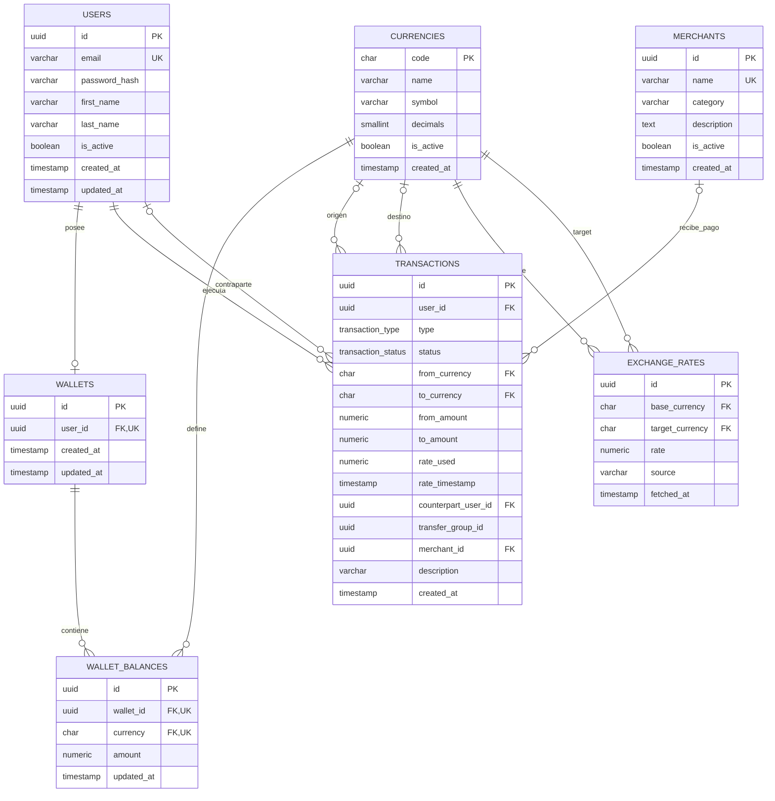

```mermaid
erDiagram
    USERS {
        uuid id PK
        varchar email UK
        varchar password_hash
        varchar first_name
        varchar last_name
        boolean is_active
        timestamp created_at
        timestamp updated_at
    }

    WALLETS {
        uuid id PK
        uuid user_id FK, UK
        timestamp created_at
        timestamp updated_at
    }

    CURRENCIES {
        char code PK
        varchar name
        varchar symbol
        smallint decimals
        boolean is_active
        timestamp created_at
    }

    WALLET_BALANCES {
        uuid id PK
        uuid wallet_id FK, UK
        char currency FK, UK
        numeric amount
        timestamp updated_at
    }

    MERCHANTS {
        uuid id PK
        varchar name UK
        varchar category
        text description
        boolean is_active
        timestamp created_at
    }

    TRANSACTIONS {
        uuid id PK
        uuid user_id FK
        transaction_type type
        transaction_status status
        char from_currency FK
        char to_currency FK
        numeric from_amount
        numeric to_amount
        numeric rate_used
        timestamp rate_timestamp
        uuid counterpart_user_id FK
        uuid transfer_group_id
        uuid merchant_id FK
        varchar description
        timestamp created_at
    }

    EXCHANGE_RATES {
        uuid id PK
        char base_currency FK
        char target_currency FK
        numeric rate
        varchar source
        timestamp fetched_at
    }

    USERS ||--o| WALLETS : "posee"
    WALLETS ||--o{ WALLET_BALANCES : "contiene"
    CURRENCIES ||--o{ WALLET_BALANCES : "define"
    CURRENCIES |o--o{ TRANSACTIONS : "origen"
    CURRENCIES |o--o{ TRANSACTIONS : "destino"
    USERS ||--o{ TRANSACTIONS : "ejecuta"
    USERS |o--o{ TRANSACTIONS : "contraparte"
    MERCHANTS |o--o{ TRANSACTIONS : "recibe_pago"
    CURRENCIES ||--o{ EXCHANGE_RATES : "base"
    CURRENCIES ||--o{ EXCHANGE_RATES : "target"
```